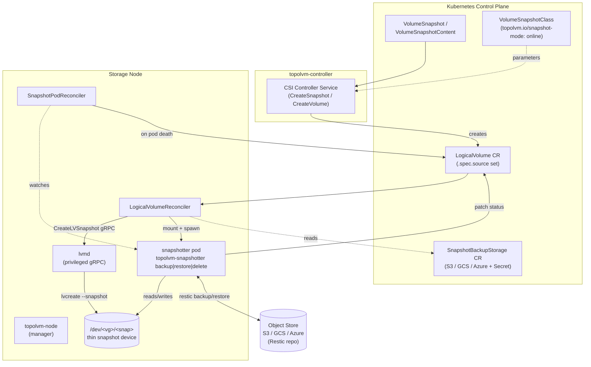
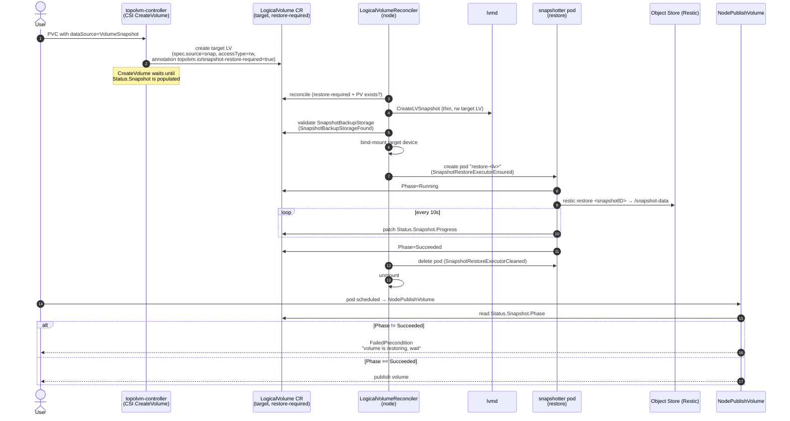
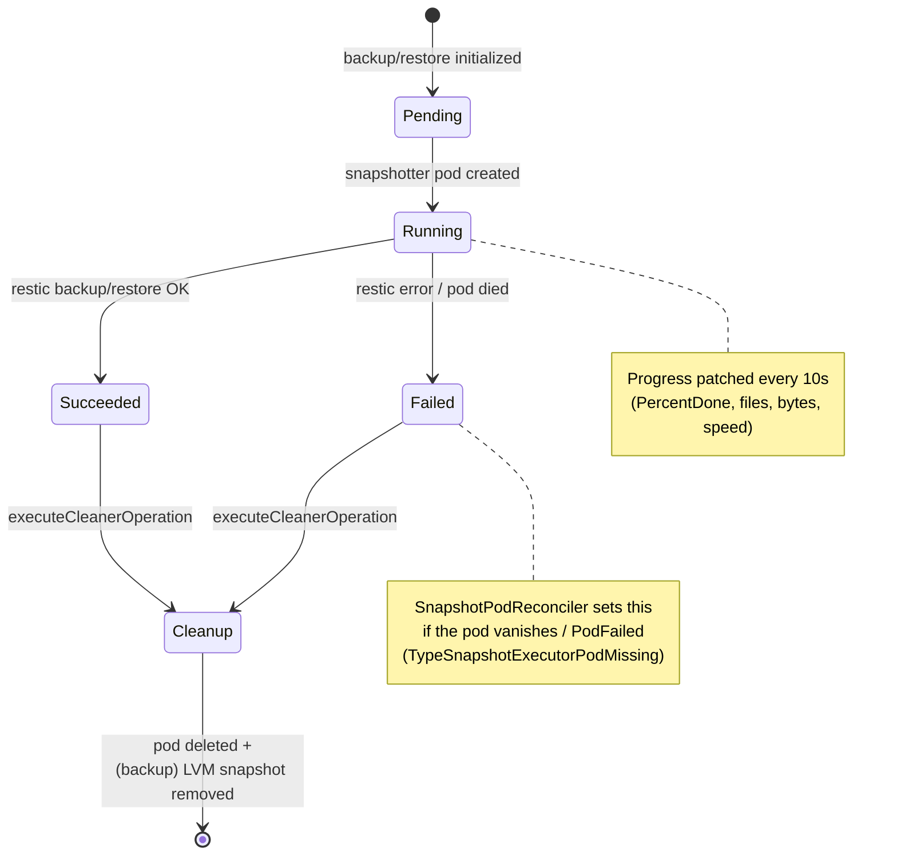
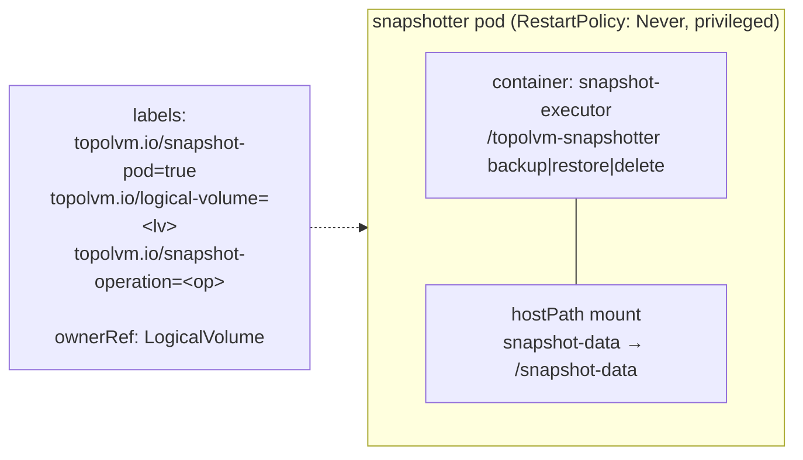

# TopoLVM Online Snapshot & Restore (Restic-Based)

> **Status:** Design / WIP — branch `design-online-snapshot`, PR
> [cloudnativestorage/topolvm#1](https://github.com/cloudnativestorage/topolvm/pull/1)
>
> **Audience:** TopoLVM contributors and reviewers working on the online
> snapshot feature.
>
> This document describes the design of the *online* (file-system-level)
> snapshot/backup/restore feature that ships LVM thin-snapshot data to an
> external object store (S3/GCS/Azure) using [Restic](https://restic.net/)
> (with Kopia planned). It complements the existing CSI volume snapshot
> support documented in [docs/snapshot-and-restore.md](../../docs/snapshot-and-restore.md).

---

## 1. Motivation

TopoLVM's built-in CSI snapshots are **LVM thin snapshots**: they live on the
same Volume Group as the source volume and on the same node. That is fast and
space-efficient, but it has two hard limits:

1. **Locality** — the snapshot cannot survive the loss of the node or VG that
   holds it. It is not a backup.
2. **Capacity** — every snapshot consumes thin-pool space on the storage node.

The *online snapshot* feature solves both by treating the LVM thin snapshot as
a short-lived, crash-consistent staging point whose data is immediately copied
("backed up") to durable, off-node object storage via Restic. Once the data is
safely in the object store, the LVM thin snapshot is removed. Restore reverses
the flow: a fresh LV is created, the Restic data is streamed back into it, and
only then is the volume allowed to be published to a workload.

"Online" means the source workload keeps running during the snapshot — we take
a point-in-time **thin snapshot** of the live volume and back *that* up, rather
than quiescing the application.

---

## 2. Key Concepts & Vocabulary

| Term | Meaning |
|------|---------|
| **LV Snapshot** | An LVM thin snapshot created by `lvmd` via `lvcreate --snapshot`. Crash-consistent, node-local, short-lived. |
| **LogicalVolume (LV) CR** | The Kubernetes CR that coordinates `topolvm-controller` and `topolvm-node`. A snapshot is represented as an LV CR with `Spec.Source` set. |
| **SnapshotBackupStorage CR** | Cluster/namespace config object describing the Restic backend (S3/GCS/Azure), credentials secret, and engine-specific flags. |
| **Snapshotter pod** | A short-lived, node-pinned pod that mounts the LV snapshot device and runs `topolvm-snapshotter {backup,restore,delete}`. |
| **Backup engine** | The pluggable provider abstraction (`internal/backupengine`) that wraps Restic (Kopia planned). |
| **Online mode** | Selected per-snapshot through the `VolumeSnapshotClass` parameter `topolvm.io/snapshot-mode: online`. |

---

## 3. Components



| Component | Source | Role |
|-----------|--------|------|
| CSI Controller Service | `internal/driver/controller.go` | Translates `CreateSnapshot` / `CreateVolume(from snapshot)` into LV CRs. |
| `LogicalVolumeReconciler` | `internal/controller/logicalvolume_controller.go` | Per-node reconciler. Orchestrates LV snapshot creation, mount, executor pod, cleanup. |
| `SnapshotPodReconciler` | `internal/controller/snapshot_pod_controller.go` | Watches snapshotter pods; fails the operation if a pod dies mid-flight. |
| `SnapshotBackupStorageReconciler` | `internal/controller/snapshotbackupstorage_controller.go` | Validates the backend and reports a `Ready`/`Error` phase. |
| `lvmd` | `internal/lvmd/lvservice.go` | Creates/activates/removes thin snapshots via LVM. |
| Executor builders | `internal/executor/` | Build the snapshotter pod spec + argv (golden-tested contract). |
| Backup engine | `internal/backupengine/` | Restic provider, progress reporter. |
| `topolvm-snapshotter` | `cmd/topolvm-snapshotter/` | The binary that runs inside the snapshotter pod. |

---

## 4. Custom Resources

### 4.1 LogicalVolume status (snapshot extension)

The snapshot state machine is persisted entirely in
`LogicalVolume.Status.Snapshot` (`api/v1/logicalvolume_types.go`):

```go
type SnapshotStatus struct {
    Operation      OperationType      // Backup | Restore | Delete
    Phase          OperationPhase     // Pending | Running | BackingUp | Restoring | Succeeded | Failed
    StartTime      metav1.Time
    CompletionTime *metav1.Time
    Duration       string
    Progress       *OperationProgress // % done, files, bytes, speed (polled every 10s)
    Message        string
    Error          *SnapshotError
    Path           string             // repository directory inside the backend
    Repository     string             // resolved Restic repository URL
    SnapshotID     string             // Restic snapshot id (set on backup success)
    Version        string             // engine identity, e.g. "restic"
}
```

Progress is reported live (`OperationProgress`: `PercentDone`, `TotalFiles`,
`FilesDone`, `TransferDone`, `Total`, `Speed`, `SecondsElapsed`).

In addition, fine-grained progress through the multi-step flow is tracked with
`metav1.Condition`s on the LV (see §7).

### 4.2 SnapshotBackupStorage

Backend configuration (`api/v1/snapshotbackupstorage_types.go`):

```go
type SnapshotBackupStorageSpec struct {
    Engine           BackupEngine // "restic" (Kopia planned)
    Storage          *Storage     // provider + S3/GCS/Azure sub-spec
    GlobalFlags      []string     // e.g. ["--no-lock", "--limit-upload=4"]
    BackupFlags      []string
    RestoreFlags     []string
    ValidateOnCreate bool
}

type Storage struct {
    Provider StorageProvider // s3 | gcs | azure
    S3       *S3Spec
    GCS      *GCSSpec
    Azure    *AzureSpec
}
```

Each backend sub-spec (`S3Spec`, `GCSSpec`, `AzureSpec`) carries a
`Bucket`/`Container`, `Prefix`, `MaxConnections`, and a `SecretName` that holds
the credentials. The secret is also used as the Restic **encryption** secret
(`RESTIC_PASSWORD`). Status reports `Phase` (`Ready`/`Pending`/`Error`),
`Message`, and `LastChecked`.

A snapshot selects its backend through two `VolumeSnapshotClass` parameters:

```yaml
parameters:
  topolvm.io/snapshot-mode: online
  topolvm.io/snapshot-storage-name: my-s3-backend
  topolvm.io/snapshot-storage-namespace: topolvm-system
```

---

## 5. Backup Flow (snapshot creation)

```mermaid
sequenceDiagram
    autonumber
    actor User
    participant Snap as external-snapshotter
    participant CSI as topolvm-controller<br/>(CSI CreateSnapshot)
    participant LV as LogicalVolume CR
    participant LVR as LogicalVolumeReconciler<br/>(node)
    participant LVMD as lvmd
    participant Pod as snapshotter pod<br/>(backup)
    participant OBJ as Object Store (Restic)

    User->>Snap: kubectl apply VolumeSnapshot
    Snap->>CSI: CreateSnapshot(sourceVolID, name)
    CSI->>LVMD: GetVolume(source) — read size/node/class
    CSI->>LV: create LV CR (spec.source=src, accessType=ro)
    Note over CSI,Snap: ReadyToUse=false<br/>(online backup still pending)

    LVR->>LV: reconcile (sees spec.source)
    LVR->>LVMD: CreateLVSnapshot (thin, ro)
    LVMD-->>LVR: thin snapshot device
    LVR->>LV: validate SnapshotBackupStorage exists<br/>(condition: SnapshotBackupStorageFound)
    LVR->>LVR: mount device ro,norecovery,nouuid
    LVR->>Pod: create pod "backup-<lv>"<br/>(condition: SnapshotBackupExecutorEnsured)

    Pod->>LV: Phase=Running, StartTime
    Pod->>OBJ: restic backup /snapshot-data
    loop every 10s
        Pod->>LV: patch Status.Snapshot.Progress
    end
    OBJ-->>Pod: snapshot id
    Pod->>LV: Phase=Succeeded, SnapshotID, Path, Repository

    LVR->>LV: operation complete → cleanup
    LVR->>Pod: delete pod (condition: SnapshotBackupExecutorCleaned)
    LVR->>LVMD: remove thin snapshot (condition: LVMSnapshotCleaned)
    Note over LV,OBJ: data durable in object store;<br/>node-local thin snapshot gone
```

**Notes**

- The CSI snapshot id returned to Kubernetes is the **LV CR's `VolumeID`**, not
  a raw LVM object. `ReadyToUse` is `false` until the backup phase reaches
  `Succeeded` (see `internal/driver/internal/k8s/logicalvolume_service.go`).
- Only **thin** device classes support snapshots. `lvmd` rejects thick volumes
  with `codes.Unimplemented` (`internal/lvmd/lvservice.go`).
- The backup mount is read-only and crash-tolerant: `ro,norecovery,nouuid`.
- The thin snapshot is intentionally **removed after a successful backup** — the
  durable copy lives in the object store, not on the node.

---

## 6. Restore Flow



**The deferred-restore contract.** Restore is signalled by the
`topolvm.io/snapshot-restore-required` annotation
(`constants.go: GetResticRestoreRequiredKey()` →
`topolvm.io/snapshot-restore-required`). Two gates enforce it:

1. **CSI `CreateVolume`** blocks (`waitForVolumeProvisioning`) until the target
   LV's `Status.Snapshot` is populated, i.e. the restore has actually started.
2. **CSI `NodePublishVolume`** (`internal/driver/node.go`) refuses to publish
   while `Status.Snapshot.Phase != Succeeded`, returning
   `codes.FailedPrecondition`. The workload only sees the volume once the data
   is fully restored.

The restore pod's argv carries the source snapshot's `Path` and `SnapshotID`,
read from the source LV's `Status.Snapshot` (see §8).

---

## 7. State Machine & Conditions

The operation phase (`Status.Snapshot.Phase`) is the coarse state; the
`metav1.Condition`s record the orchestration sub-steps so each one is
idempotent and resumable across reconciles.



**Condition types** (`api/v1/constants.go`) — each toggled True/False as the
reconciler advances:

| Condition | Meaning |
|-----------|---------|
| `SnapshotBackupStorageFound` | The referenced `SnapshotBackupStorage` exists. |
| `SnapshotBackupExecutorEnsured` | Backup pod has been created. |
| `SnapshotRestoreExecutorEnsured` | Restore pod has been created. |
| `SnapshotBackupExecutorCleaned` | Backup pod unmounted + deleted. |
| `SnapshotRestoreExecutorCleaned` | Restore pod unmounted + deleted. |
| `LVMSnapshotCleaned` | Thin snapshot LV removed after backup. |
| `SnapshotDeleteExecutorEnsured` / `SnapshotDeleteEnsured` | Delete pod lifecycle. |
| `SnapshotExecutorPodMissing` | Pod died mid-flight; operation forced to `Failed`. |

Reconcile decisions are driven by helper predicates such as
`isSnapshotOperationComplete()` (Phase ∈ {Succeeded, Failed}),
`hasSnapshotBackupExecutorCondition()`, and
`hasLVMSnapshotCleanupCondition()` in
`internal/controller/logicalvolume_conditions.go` and
`internal/controller/snapshot_handler.go`.

---

## 8. Snapshotter Pod & Executor Contract

The `internal/executor` package builds a node-pinned, owner-referenced pod by
cloning the `topolvm-node` DaemonSet's pod template (so it inherits the image,
tolerations, and host mounts) and replacing the container with a single
`topolvm-snapshotter` invocation. The argv is **golden-tested** — treat it as a
stable contract.



**Pod metadata** (`internal/executor/common.go`, `constants.go`)

- Name: `<operation>-<lv.Name>` (e.g. `backup-my-lv`, `restore-my-lv`).
- Namespace: `HOST_NAMESPACE` env (default `topolvm-system`).
- Labels: `app=topolvm-snapshot`, `topolvm.io/snapshot-pod=true`,
  `topolvm.io/logical-volume=<lv>`, `topolvm.io/snapshot-operation=<op>`.
- OwnerReference → the LogicalVolume (controller=true), so the pod is GC'd with
  the LV.

**argv contract** (`internal/executor/{backup,restore,delete}.go`)

```text
# backup
/topolvm-snapshotter backup \
  --lv-name=<lv> --node-name=<node> --mount-path=snapshot-data \
  --targeted-pvc-namespace=<ns> --targeted-pvc-name=<name> \
  --snapshot-storage-name=<sbs> --snapshot-storage-namespace=<sbs-ns>

# restore
/topolvm-snapshotter restore \
  --lv-name=<lv> --node-name=<node> \
  --repo-path=<sourceLV.Status.Snapshot.Path> \
  --snapshot-id=<sourceLV.Status.Snapshot.SnapshotID> \
  --snapshot-storage-name=<sbs> --snapshot-storage-namespace=<sbs-ns>

# delete
/topolvm-snapshotter delete \
  --lv-name=<lv> --repo-path=<lv.Status.Snapshot.Path> \
  --snapshot-storage-name=<sbs> --snapshot-storage-namespace=<sbs-ns>
```

Backup/restore containers run **privileged** with a hostPath mount of the
mounted snapshot directory; the delete container needs no local storage and
runs unprivileged.

---

## 9. Backup Engine (Restic Provider)

`internal/backupengine` defines a provider abstraction so the engine can be
swapped (Restic today, Kopia planned):

```go
type Provider interface {
    ValidateConnection(ctx context.Context) error
    Backup(ctx context.Context, p *BackupParam) (*BackupResult, error)
    Restore(ctx context.Context, p *RestoreParam) (*RestoreResult, error)
    Delete(ctx context.Context, p *DeleteParam) ([]byte, error)
}
```

The Restic provider (`internal/backupengine/provider/restic.go`):

1. Resolves the backend from the `SnapshotBackupStorage` CR + credentials
   secret into Restic env vars (`RESTIC_REPOSITORY`, `RESTIC_PASSWORD`, plus
   provider creds like `AWS_ACCESS_KEY_ID`).
2. Initializes the repo if absent and ensures no exclusive lock.
3. Runs `restic backup` / `restore` / `forget`+`prune` via a wrapper.
4. Streams progress: a goroutine polls Restic status every **10s** and patches
   `Status.Snapshot.Progress` on the LV
   (`internal/backupengine/progress/`).

`BackupResult` carries `SnapshotID`, `Path`, `Repository`, `Size`, file counts,
`Duration`, and engine `Version`; the snapshotter writes these back to the LV
on success.

---

## 10. Failure & Edge Cases

These are documented in `prompts/` and handled by the reconcilers:

| Scenario | Handling |
|----------|----------|
| **Snapshotter pod deleted / PodFailed mid-operation** | `SnapshotPodReconciler` (watches `topolvm.io/snapshot-pod=true`) forces `Phase=Failed` with condition `SnapshotExecutorPodMissing`; the LV controller then runs the normal cleanup path (unmount → delete pod → remove thin snapshot → drop finalizer). Without this, the LV would wait on a pod that no longer exists. |
| **PVC/PV/LV deleted during restore** | The restore pod holds the device open, so a naive `lvremove` fails ("filesystem in use"). The controller deletes the executor pod **first**, then unmounts, then removes the LV. |
| **VolumeSnapshot deleted during backup** | Same ordering as above for the backup pod, then the thin snapshot is removed. |
| **Missing `SnapshotBackupStorage`** | Condition `SnapshotBackupStorageFound=False`; the operation does not start and is requeued. |
| **Thick device class** | `lvmd` returns `codes.Unimplemented`; only thin snapshots are supported. |
| **Restore not finished when workload schedules** | `NodePublishVolume` returns `FailedPrecondition` until `Phase=Succeeded`. |

---

## 11. Cross-References

- Code:
  - `internal/controller/logicalvolume_controller.go` — orchestration entry point
  - `internal/controller/snapshot_handler.go` — backup/restore/cleanup logic
  - `internal/controller/snapshot_pod_controller.go` — pod-death watchdog
  - `internal/executor/` — pod spec + argv (golden tests)
  - `internal/backupengine/` — Restic provider + progress
  - `cmd/topolvm-snapshotter/` — the in-pod binary
  - `api/v1/logicalvolume_types.go`, `api/v1/snapshotbackupstorage_types.go`,
    `api/v1/constants.go` — types & constants
  - `internal/lvmd/lvservice.go`, `pkg/lvmd/proto/lvmd.proto` — `CreateLVSnapshot`
- Docs: [docs/snapshot-and-restore.md](../../docs/snapshot-and-restore.md),
  [docs/design.md](../../docs/design.md),
  [docs/logical-volume-crd.md](../../docs/logical-volume-crd.md)
- Edge-case task notes: `prompts/`
